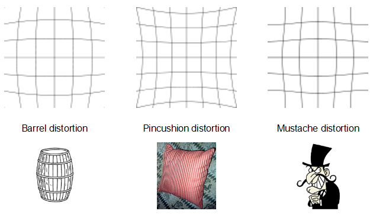
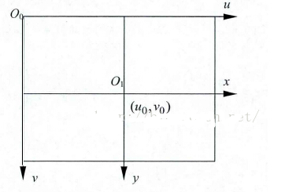
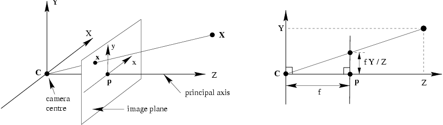

## Camera Calibration Tutorials

### Goal

- Learn about distortions in camera, intrinsic and extrinsic parameters of camera etc.
- Learn to find these parameters, undistort images etc.


### Basics

- **Opencv 3.0 + Python3**
- **checkerboard with 8x10 squares and 7x9 internal corners**
- **func : cv2.findChessboardCorners( )** , **cv2.undistort( )**

### Distortion

Pinhole cameras introduce a lot of distortion to images, Two major distortions are `radial distortion` and `tangential distortion`.

- `Radial distortion`
`Radial distortion` concludes `barrel distortion`, `pincushion distortion` and `mustache distortion`. Due to radial distortion, straight lines will appear curved as shown below:


Radial distortion can be solved as follows:
$$
\begin{aligned}
x_{corrected = x(1+k_1r^2 + k_2r^4 + k_3r^6)} \\
y_{corrected = y(1+k_1r^2 + k_2r^4 + k_3r^6)} 
\end{aligned}
$$

- `Tangential distortion`
`Tangential distortion` occurs because of image takeing lense is not aligned perfectly parallel to the imaging plane. So some areas in image may look nearer than expected. It is solved below:

$$
\begin{aligned}
x_{corrected = x(2p_1xy+p_2(r^2+2x^2))} \\
y_{corrected = y(p_1(r^2+2y^2)+2p_2xy)} 
\end{aligned}
$$

In short, we need to find five parameters, known as **`distortion coefficients`** given by:
$$ {Distortion} \quad {coefficients}= (k_1,k_2,p_1,p_2,k_3)$$

### Calibration

#### Coordinates System

There are four basic coordinate system:
- world coordinate system $ (X_w,Y_w,Z_w)$
- camera coordinate system $(X_c, Y_c, Z_c)$
- image coordinate system$ (x,y)$
- pixel plane coordinate system $ (u,v)$

calibration has three stage:
- Convert 3D points from world coordinate system to camera coordinate system. It involved camera extrinsic parameters R,t etc.
- Convert 3D points in camera coordinate system to 2D points in image coordinate system.
- Convert 2D points from image coordinate to pixel plane coordinate


#### Coordinates Conversion

##### pixel plane coordinate and image coordinate

The relationship between pixel plane coordinate and image coordinate is shown as below. Pixel plane and image plane are at the same plane, but there center are different. Besides, the pixel plane measures the length in pixel, while the image coordinate are  measured the length in meters.The coordinates' conversion can be expressed in mathematical formula.



$$
\begin{aligned}
 u=\frac{x}{dx}+u_0\\
 v=\frac{y}{dy}+v_0
 \end{aligned}
$$

The matrix expression is:

$$
\begin{bmatrix}
u\\
v\\
1
\end{bmatrix}
= \begin{bmatrix}
\frac{1}{dx}&0&u_0\\
0&\frac{1}{dy}&v_0\\
0&0&1
\end{bmatrix} 
\begin{bmatrix}
x\\
y\\
1
\end{bmatrix}
$$
  
##### camera coordinate and world coordinate

Three coordinates' relationships are shown as below:


- C : camera centre
- Z : principle axis
- the distance from C to P is focal length 
- image plane is the location of image coordinate 
- $ (u_0,v_0)$is the optical center of pixel plane
- $ dx , dy $ are act actual width and length of pixel.

The conversion of camera coordinate and world coordinate can be expressed as follows:
R is rotate `transform matrix`, t is `translation matrix`.

$$
\begin{bmatrix}
X_c\\
Y_c\\
Z_c
\end{bmatrix}=
\begin{bmatrix}
R&t\\
0^T&1
\end{bmatrix}
\begin{bmatrix}
X\\
Y\\
Z\\
1
\end{bmatrix}
$$


##### Camera coordinate and image coordinate


 According to the triangle similarity principle:

 $$
 \begin{aligned}
 \frac{x}{f}=\frac{X_c}{Z_c}\\
 \frac{y}{f}=\frac{Y_c}{Z_c}
 \end{aligned}
 =>
 \begin{aligned}
 Z_c\cdot x = f\cdot X_c\\
 Z_c\cdot y = f\cdot Y_c
 \end{aligned}
$$ 
$ =>$ 
$$
 Z_c
 \begin{bmatrix}
 x\\
 y\\
 1
 \end{bmatrix}
 =\begin{bmatrix}
f&0&0&0\\
0&f&0&0\\
0&0&1&0
\end{bmatrix}
\begin{bmatrix}
X_c\\
Y_c\\
Z_c\\
1
\end{bmatrix}
$$


##### Camera parameters

In conclusion,
$$
 Z_c
 \begin{bmatrix}
 u\\
 v\\
 1
 \end{bmatrix}
 =\begin{bmatrix}
\frac{1}{dx}&0&u_0\\
0&\frac{1}{dy}&v_0\\
0&0&1
\end{bmatrix} 
 \begin{bmatrix}
f&0&0&0\\
0&f&0&0\\
0&0&1&0
\end{bmatrix}
\begin{bmatrix}
R&t\\
0^T&1
\end{bmatrix}
\begin{bmatrix}
X\\
Y\\
Z\\
1
\end{bmatrix}
$$


Thus, the intrinsic parameters matrix is :

$$
 \begin{bmatrix}
f_x&0&u_0&0\\
0&f_y&v_0&0\\
0&0&1&0
\end{bmatrix}=
\begin{bmatrix}
\frac{1}{dx}&0&u_0\\
0&\frac{1}{dy}&v_0\\
0&0&1
\end{bmatrix} 
 \begin{bmatrix}
f&0&0&0\\
0&f&0&0\\
0&0&1&0
\end{bmatrix}
$$

And the extrinsic parameters matrix is :$ \begin{bmatrix}
R&t\\
0^T&1
\end{bmatrix}$


### Undistort


For stereo applications, camera distortion need to be corrected first. To find all camera parameters, what we have to do is to provide some sample images of a well defined pattern(eg,chess board).We find some specific points in it(square corners in chess board). We know its coordinates in real world space and we know its coordinate in image. With these data, some mathematical problem is solved in background to get the distortion coefficients. That is the summary of the whole story. For better results, we need at least 10 test pattern.


### Code


We take the chess board which has 7*9 grid as our test pattern(in the ` cali-img ` folder). These images points are the locations where two black squares touch each other in the chess boards.  For sake of camera calibration, we need important data of 3D real world points and its corresponding 2D image points. 


- 2D image points can be easily found from test image.  
- 3D points in real world can be get from chess board's square size.
 Because that these images are taken from a static camera and chess boards are placed at different locations and orientations. So we need to know (X,Y,Z) values. But for simplicity, we can say chess board was kept stationary at XY plane, (so Z=0 always) and camera was moved accordingly. This consideration helps us to find only X,Y values. Now for X,Y values, we can simply pass the points as (0,0), (1,0), (2,0), ... which denotes the location of points. In this case, the results we get will be in the scale of size of chess board square. But if we know the square size, (say 30 mm), and we can pass the values as (0,0),(30,0),(60,0),..., we get the results in mm. (In this case, we don’t know square size since we didn’t take those images, so we pass in terms of square size). 

 3D points are called **`Object points`** and image points are called **`image points `**


 ### Setup

In order to find pattern in chess board, we use the func  **`cv2.findChessboardCorners()`**. The test image we used is a chess board with 8x10 squares and 7x9 internal corners. It returns the corner points and retval which will be True if pattern is obtained. These corners will be placed in an order (from left-to-right, top-to-bottom).

**see also:** Instead of chess board, we can use some circular grid, but then use the function cv2.findCirclesGrid() to find the pattern. It is said that less number of images are enough when using circular grid.


```py
import numpy as np
import cv2
import glob

# termination criteria

# criteria（type,max_iter,epsilon）: 
#type :  1. cv2.TERM_CRITERIA_EPS: iteration stop when accuracy error meet epsilon
#        2. cv2.TERM_CRITERIA_MAX_ITER: iteration stop when iterate times more than max_iter 
#        3. cv2.TERM_CRITERIA_EPS+cv2.TERM_CRITERIA_MAX_ITER : iteration stop when meet any of them .

criteria = (cv2.TERM_CRITERIA_EPS + cv2.TERM_CRITERIA_MAX_ITER, 30, 0.001)


# prepare object points, like (0,0,0), (1,0,0), (2,0,0) ....,(9,7,0) 
# chess board has 7x9 internal corners 
objp = np.zeros((7*9,3), np.float32)
objp[:,:2] = np.mgrid[0:9,0:7].T.reshape(-1,2)

# Arrays to store object points and image points from all the images.
objpoints = [] # 3d point in real world space
imgpoints = [] # 2d points in image plane.

# read all jpg format images from workspace
images = glob.glob('*.jpg')

for fname in images:
    img = cv2.imread(fname)
    gray = cv2.cvtColor(img,cv2.COLOR_BGR2GRAY)

    # Find the chess board corners
    ret, corners = cv2.findChessboardCorners(gray, (9,7),None)

    # If found, add object points, image points (after refining them)
    if ret == True:
        objpoints.append(objp)

        corners2 = cv2.cornerSubPix(gray,corners,(11,11),(-1,-1),criteria)
        imgpoints.append(corners2)

        # Draw and display the corners
        img = cv2.drawChessboardCorners(img, (9,7), corners2,ret)
        cv2.imshow('img',img)
        cv2.waitKey(2000)

cv2.destroyAllWindows()

ret, mtx, dist, rvecs, tvecs = cv2.calibrateCamera(objpoints, imgpoints, gray.shape[::-1],None,None)

# print the camera matrix
print(mtx)


#using undistort
img = cv2.imread('chess08.jpg')
h,  w = img.shape[:2]
newcameramtx, roi=cv2.getOptimalNewCameraMatrix(mtx,dist,(w,h),1,(w,h))

# undistort
dst = cv2.undistort(img, mtx, dist, None, newcameramtx)

# crop the image
x,y,w,h = roi
dst = dst[y:y+h, x:x+w]
cv2.imwrite('calibresult1.png',dst)


#using remaping
# undistort
mapx,mapy = cv2.initUndistortRectifyMap(mtx,dist,None,newcameramtx,(w,h),5)
dst = cv2.remap(img,mapx,mapy,cv2.INTER_LINEAR)

# crop the image
x,y,w,h = roi
dst = dst[y:y+h, x:x+w]
cv2.imwrite('calibresult2.png',dst)


mean_error = 0
tot_error =0
for i in range(len(objpoints)):
    imgpoints2, _ = cv2.projectPoints(objpoints[i], rvecs[i], tvecs[i], mtx, dist)
    error = cv2.norm(imgpoints[i],imgpoints2, cv2.NORM_L2)/len(imgpoints2)
    tot_error += error
    print("tot_error %f"%(tot_error))

    
print ("total error: %f"%(tot_error/len(objpoints)))

```


